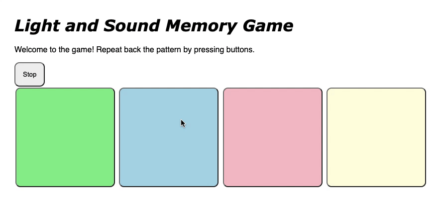
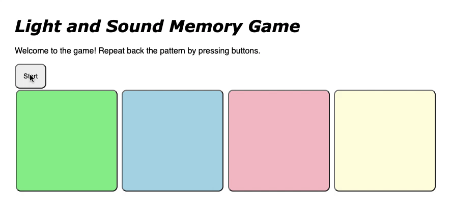

# Pre-work - *Memory Game*

**Memory Game** is a Light & Sound Memory game to apply for CodePath's SITE Program. 

Submitted by: **Yevheniya Solomyana**

Time spent: **4** hours spent in total

Link to project: https://glitch.com/edit/#!/reflective-sweet-pheasant

## Required Functionality

The following **required** functionality is complete:

* [X] Game interface has a heading (h1 tag), a line of body text (p tag), and four buttons that match the demo app
* [X] "Start" button toggles between "Start" and "Stop" when clicked. 
* [X] Game buttons each light up and play a sound when clicked. 
* [X] Computer plays back sequence of clues including sound and visual cue for each button
* [X] Play progresses to the next turn (the user gets the next step in the pattern) after a correct guess. 
* [X] User wins the game after guessing a complete pattern
* [X] User loses the game after an incorrect guess

The following **optional** features are implemented:

* [X] Any HTML page elements (including game buttons) has been styled differently than in the tutorial
* [X] Buttons use a pitch (frequency) other than the ones in the tutorial
* [ ] More than 4 functional game buttons
* [ ] Playback speeds up on each turn
* [ ] Computer picks a different pattern each time the game is played
* [ ] Player only loses after 3 mistakes (instead of on the first mistake)
* [ ] Game button appearance change goes beyond color (e.g. add an image)
* [ ] Game button sound is more complex than a single tone (e.g. an audio file, a chord, a sequence of multiple tones)
* [ ] User has a limited amount of time to enter their guess on each turn

The following **additional** features are implemented:

- [ ] List anything else that you can get done to improve the app!

## Video Walkthrough (GIF)

If you recorded multiple GIFs for all the implemented features, you can add them here:

GIF created with Kap.

## Reflection Questions
1. If you used any outside resources to help complete your submission (websites, books, people, etc) list them here. 
N/A

2. What was a challenge you encountered in creating this submission (be specific)? How did you overcome it? (recommended 200 - 400 words) 
Some parts of the tutorial were outdated, such as the starting page of the Glitch project when you open it for the first time. But thanks to the detailed instructions and notes I managed to finish the project easily. The last time I used HTML, CSS and JavaScript was a year ago and only for a week. I was concerned that it would take me longer to understand the flow of the project. In fact, I was remembering the web development concepts as I was coding and drop-down arrow expansion boxes helped me to answer my questions if I had any.

3. What questions about web development do you have after completing your submission? (recommended 100 - 300 words) 
It amazes me that the creation of websites takes three languages which basically communicate and engage with one another. Moreover, it is possible to create games and I wonder what else there is! I am curious to know the process of communication that happens behind HTML, CSS and JavaScript. Overall, it excites me to know what other features can be done with them.  

4. If you had a few more hours to work on this project, what would you spend them doing (for example: refactoring certain functions, adding additional features, etc). Be specific. (recommended 100 - 300 words) 
I would add a theme to the game, such as The Walking Dead or Star Wars. You could play a game with your favorite characters, instead of buttons. The game is also designed to the theme accordingly, including background, character phrases, tokens, etc. In addition, there could be a hint feature which will tell the player what is the next sound is supposed to be played. This could be very useful for long patterns. 

## Interview Recording URL Link

[My 5-minute Interview Recording](your-link-here)

## License

    Copyright [Yevheniya Solomyana]

    Licensed under the Apache License, Version 2.0 (the "License");
    you may not use this file except in compliance with the License.
    You may obtain a copy of the License at

        http://www.apache.org/licenses/LICENSE-2.0

    Unless required by applicable law or agreed to in writing, software
    distributed under the License is distributed on an "AS IS" BASIS,
    WITHOUT WARRANTIES OR CONDITIONS OF ANY KIND, either express or implied.
    See the License for the specific language governing permissions and
    limitations under the License.
